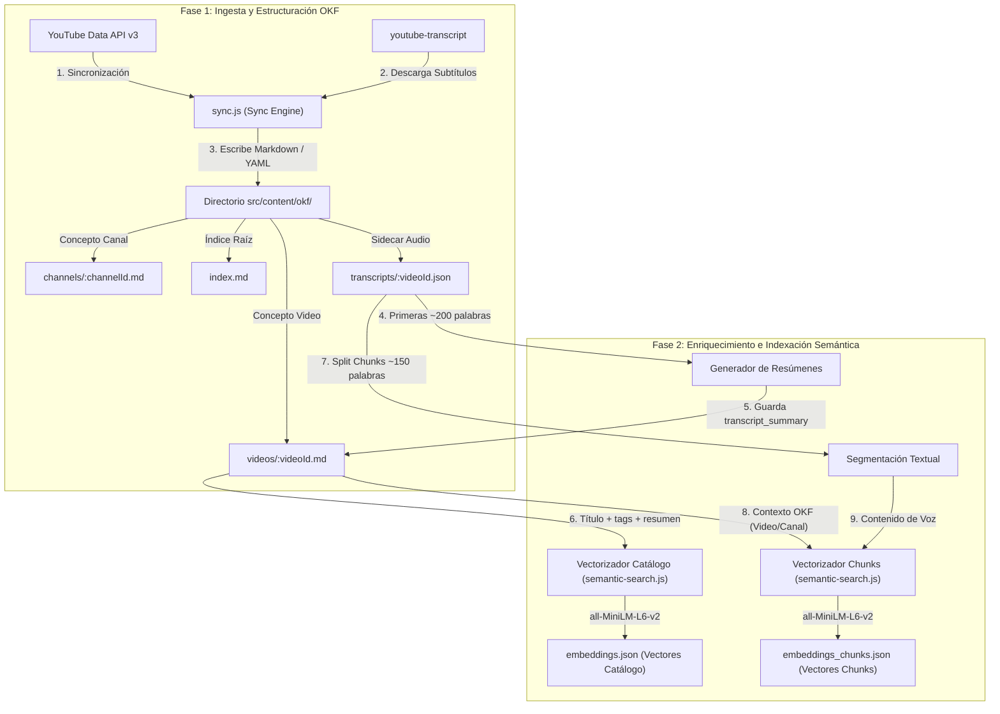
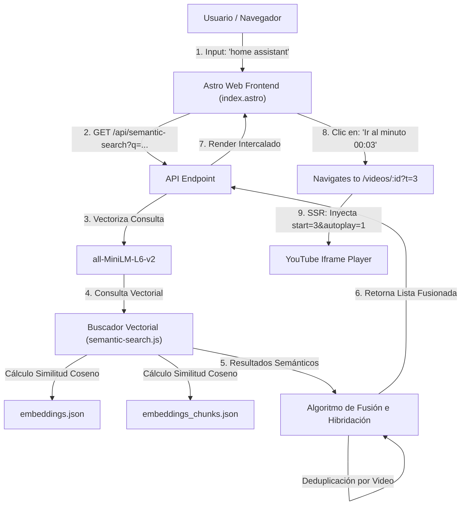
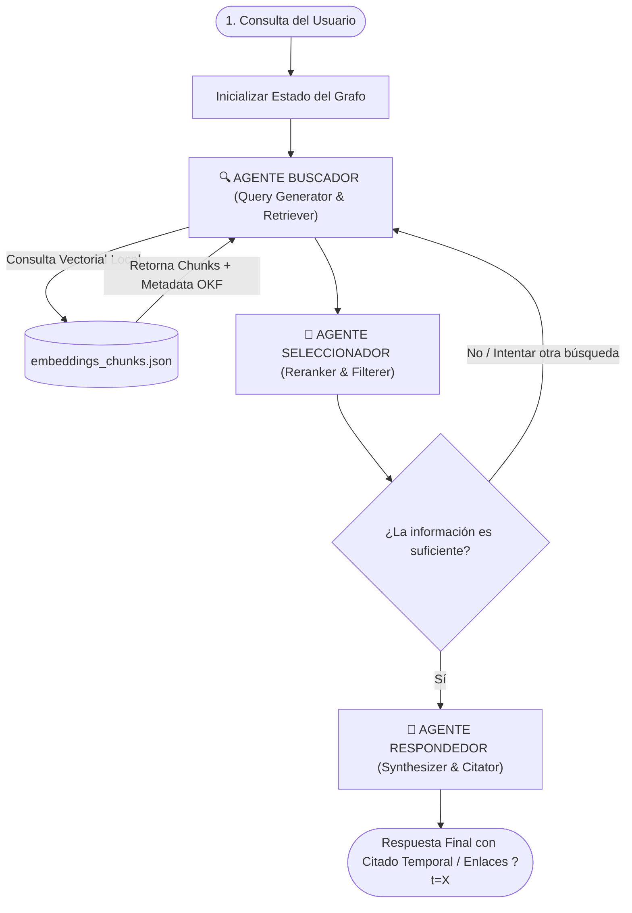
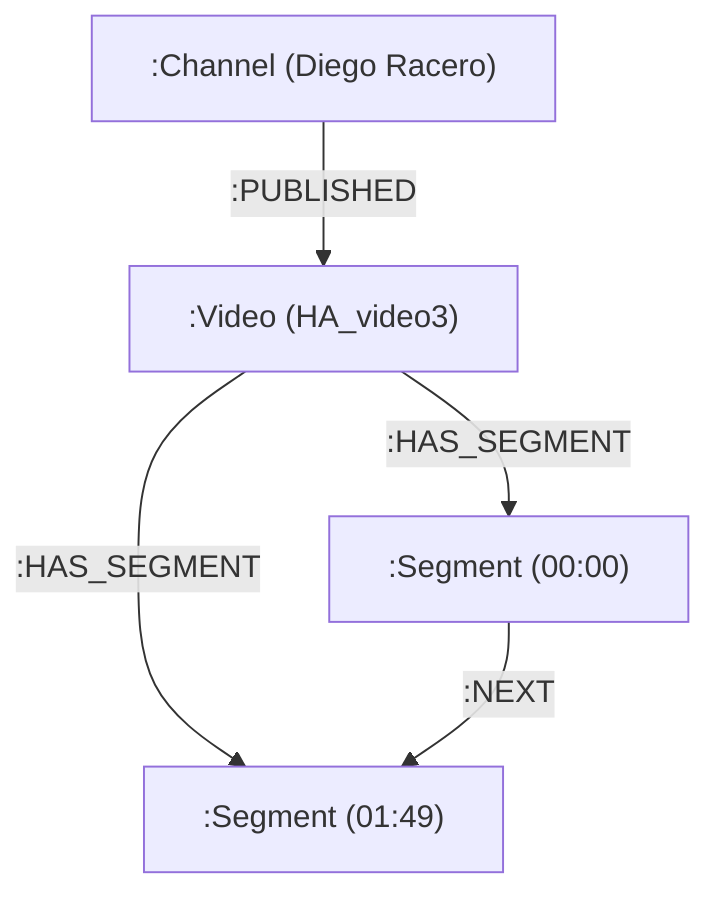

# Catálogo de YouTube Diego Racero: RAG & Open Knowledge Format (OKF)

Esta plataforma es un sistema interactivo diseñado para extraer, almacenar, estructurar y consultar semánticamente los canales y videos de YouTube de **Diego Racero** (`dracero@fi.uba.ar`). 

Combina la especificación abierta **Open Knowledge Format (OKF)** de Google Cloud para estructurar el catálogo como un grafo de conocimiento portátil, y un motor de **Búsqueda Semántica RAG (Retrieval-Augmented Generation)** gratuito y 100% local que procesa tanto los metadatos como el contenido hablado (transcripciones de audio). 

Además, incorpora un **Asistente Virtual Multi-Agente** basado en **LangGraph.js** y **Gemini 2.5 Flash** para responder de forma exacta en lenguaje natural citando fuentes del grafo de conocimiento.

---

## 🏗️ Arquitectura del Sistema

El sistema opera en tres fases principales: **Ingesta e Indexación** (sincronización y vectorización), **Búsqueda Semántica Unificada** (búsqueda vectorial híbrida local) y **Asistencia Conversacional** (flujo de agentes del chatbot).

### 1. Grafo de Ingesta, Enriquecimiento e Indexación Semántica
Este diagrama detalla cómo se extrae la información de YouTube, se estructuran los documentos bajo el formato OKF, se genera el resumen enriquecido a partir de audio/subtítulos, y se indexan los vectores de catálogo y chunks:



### 2. Flujo de Consulta Semántica Unificada
Este diagrama describe la interacción del usuario al realizar una consulta semántica, cómo el motor fusiona y deduplica los vectores de catálogo y de transcripción, y cómo se realiza la reproducción automática desde el segundo exacto:



### 3. Flujo Conversacional Multi-Agente (LangGraph)
Este diagrama ilustra cómo LangGraph coordina la comunicación del Chatbot en el backend, incluyendo la validación crítica de Gemini y el bucle recursivo de re-búsqueda vectorial en caso de que la información recuperada sea insuficiente:



---

## 📖 Integración OKF (Open Knowledge Format)

El **Open Knowledge Format (OKF)** es una especificación abierta e independiente de proveedores introducida por Google Cloud para empaquetar conocimiento organizacional de manera que sea fácilmente entendible tanto por humanos como por sistemas de inteligencia artificial (LLMs/Agentes).

### Estructura de Archivos en el Catálogo
La base de datos del proyecto se almacena en texto plano en Git dentro de `src/content/okf/`:
*   **Índice (`index.md`):** Nodo raíz del catálogo. Mapea la procedencia de los datos e incluye links relativos a los canales.
*   **Canales (`channels/*.md`):** Conceptos que describen cada canal de YouTube, sus estadísticas básicas y su handle.
*   **Videos (`videos/*.md`):** Conceptos individuales de cada video sincronizado.
*   **Sidecars (`transcripts/*.json`):** Transcripciones completas descargadas de cada video con sus respectivos offsets de tiempo en milisegundos.

### Frontmatter Enriquecido (Ejemplo Real: `fu6Mw97RVSc.md`)
Cada concepto OKF contiene un encabezado estructurado en **YAML Frontmatter** que describe de forma declarativa sus metadatos, procedencia (*sources*) y resumen de contenido:

```yaml
---
type: YouTube Video
title: "HA_video2"
description: "Configuración inicial de Home Assistant"
transcript_summary: "Bueno, lo que voy a mostrar ahora es cómo hacer para conectarme al Home Assistant y configurar una cámara ONVIF de forma automática..."
resource: "https://www.youtube.com/watch?v=fu6Mw97RVSc"
tags: ["youtube", "video", "home-assistant"]
generated: { by: "process:sync-youtube", at: "2026-08-10T17:03:55.875Z" }
verified: machine-confirmed
status: current
channel_id: "UCbSbKX3V4J28e4iJtulgEQA"
published_at: "2026-08-09T21:23:17Z"
view_count: 8
like_count: 0
comment_count: 0
duration: "12:33"
thumbnail: "https://i.ytimg.com/vi/fu6Mw97RVSc/maxresdefault.jpg"
sources:
  - id: youtube-api
    resource: "https://developers.google.com/youtube/v3"
    title: "YouTube Data API v3"
    last_modified: "2026-08-10"
  - id: channel-concept
    resource: "src/content/okf/channels/UCbSbKX3V4J28e4iJtulgEQA.md"
    title: "Channel: DiegoTestDireco"
---
```

---

## 🧠 Algoritmo de Búsqueda Semántica Unificada (RAG)

El motor de búsqueda semántica opera localmente en la CPU/GPU del servidor mediante la biblioteca `@xenova/transformers` corriendo el modelo pre-entrenado de 384 dimensiones **`Xenova/all-MiniLM-L6-v2`** (aprox. 90MB).

Para optimizar la precisión y resolver las limitaciones típicas de las bases de conocimiento dispersas, se aplican las siguientes técnicas:

### 1. Resolución de Dispersión de Metadatos (Metadata Sparsity)
Más del 96% de los videos no poseen descripciones detalladas ni tags en YouTube. Para evitar que el buscador semántico de metadatos falle por falta de información conceptual, el script de sincronización genera de forma automática un **resumen de transcripción** (`transcript_summary`) con las primeras ~200 palabras pronunciadas en el video y lo inyecta como metadato permanente en el archivo OKF.

### 2. Segmentación Contextual de Transcripciones (Context-Aware Chunking)
El audio de los videos se divide en fragmentos ("chunks") solapados de aproximadamente 150 palabras para ajustarse al contexto semántico fino.
Para evitar que un chunk pierda su relación con el video de origen al vectorizarse, el texto enviado al modelo de embeddings se genera preponiendo el contexto del nodo OKF al que pertenece:

$$\text{Texto Vectorizado} = \text{"Video: \"[Título]\" | Canal: \"[Canal]\" | Contenido: [Texto Hablado]"}$$

De este modo, una búsqueda que contenga el nombre del video o palabras del canal coincidirá semánticamente mucho mejor con sus chunks internos de audio.

### 3. Búsqueda Vectorial Híbrida (Hybrid Retrieval & Keyword Boost)
El cálculo primario de coincidencia se basa en la **similitud de coseno** entre los vectores normalizados:

$$\text{Similitud} = \cos(\vec{u}, \vec{v}) = \frac{\vec{u} \cdot \vec{v}}{\|\vec{u}\| \|\vec{v}\|}$$

Dado que los vectores semánticos a veces sufren para distinguir términos de código específicos (ej. "Home Assistant" vs "Wit.ai"), implementamos un **Keyword Boost**:
* Si hay coincidencia exacta de la frase de búsqueda dentro del texto del segmento, se le añade un **boost matemático de +0.35** al score de similitud.
* Si coinciden palabras clave individuales del query, se añade un boost proporcional de hasta **+0.20**.

### 4. Fusión de Índices y Deduplicación Inteligente
La consulta semántica busca en paralelo en la colección de videos/canales y en la colección de chunks.
Para presentar una interfaz clara al usuario, el algoritmo:
* Agrupa e intercala los resultados por relevancia final.
* Limita a un máximo de **3 segmentos de transcripción por video** para evitar acaparar los resultados.
* Si un video aparece listado en sus segmentos clave (deep-linking), el sistema **oculta la tarjeta general de catálogo** de dicho video, evitando duplicar contenido inútilmente y optimizando la densidad de información.

### 5. Reproducción Dinámica con Deep Linking
Al seleccionar un fragmento de transcripción en los resultados, el enlace redirige al usuario a `/videos/[id]?t=[segundos]`.
El servidor Astro (SSR) lee este parámetro en tiempo real y altera la inicialización del reproductor embebido de YouTube:

```html
<iframe src="https://www.youtube.com/embed/[id]?start=[segundos]&autoplay=1" ...></iframe>
```
Esto fuerza a la API del reproductor de YouTube a iniciar la reproducción de forma interactiva desde el segundo exacto en el que el orador mencionó el término buscado.

---

## 💬 Asistente RAG Multi-Agente (LangGraph + Gemini 2.5 Flash)

La plataforma integra un **asistente conversacional de tipo Chat** accesible desde la interfaz web. Este módulo está diseñado para responder consultas del usuario en lenguaje natural basándose en el contenido de los videos y está estructurado como un grafo de estado asíncrono utilizando **LangGraph.js** y **Gemini 2.5 Flash** (SDK `@google/genai`).

### Estructura y Nodos del Grafo (`src/lib/agent-graph.js`)
1.  **Estado Compartido (`ChatState`):** Un objeto de anotación de LangGraph que mantiene la pregunta original, la query optimizada de búsqueda, los fragmentos recuperados localmente, los fragmentos seleccionados como relevantes por el LLM, el contador de intentos de búsqueda y la respuesta en texto.
2.  **Agente Buscador (`searcherNode`):** Invoca de forma asíncrona la búsqueda semántica unificada local sobre los archivos OKF y guarda los chunks resultantes en el estado.
3.  **Agente Seleccionador (`selectorNode`):** Evalúa críticamente los fragmentos devueltos mediante Gemini 2.5 Flash. Devuelve una estructura JSON limpia con los IDs de los fragmentos que son realmente relevantes.
    *   *Query Expansion (Bucle de re-búsqueda):* Si el selector determina que la información es insuficiente y no se ha superado el límite de 2 intentos, solicita a Gemini generar un término de búsqueda alternativo (ej. transformar *"cómo conectar cámara a home assistant"* en *"Integrar cámara Home Assistant"*), actualiza el estado y regresa recursivamente al nodo buscador.
4.  **Agente Respondedor (`responderNode`):** Toma la información seleccionada y genera una respuesta amigable en Markdown. Si la información no se encuentra en las transcripciones, responde de forma directa y honesta evitando alucinaciones. Inyecta citas formateadas vinculadas al segundo exacto (ej. `[⏱ Ir al minuto 11:06](/videos/fu6Mw97RVSc?t=666)`).

---

## 🕸️ Integración de Neo4j GraphRAG (Grafo de Conocimiento Local)

Para maximizar el valor del estándar **Open Knowledge Format (OKF)**, el proyecto integra una instancia local de **Neo4j** (`bolt://localhost:7687`) que indexa automáticamente los metadatos de canales, videos y segmentos de transcripción.



### Características de la Integración (`src/lib/neo4j.js`):
1. **Índice Vectorial HNSW Nativo:** Habilita búsquedas vectoriales en tiempo logarítmico $\mathcal{O}(\log N)$ directamente en Cypher mediante `db.index.vector.queryNodes('transcript_vector_index', limit, vector)`.
2. **Contexto Secuencial Implícito (`:NEXT`):** La relación entre segmentos contiguos permite recuperar de forma instantánea el contexto hablado anterior y posterior sin recalcular embeddings.
3. **Poblado Automático desde OKF:** La función `seedNeo4jFromOKF()` se ejecuta automáticamente durante el sync (`sync.js`), sincronizando todos los nodos y vectores.
4. **Fallback Transparente:** Si la instancia local de Neo4j está apagada, el sistema conmuta automáticamente a los archivos JSON de embeddings locales sin interrumpir el servicio.

---

## 🏛️ Directivas de Calidad, Patrones de Diseño y Seguridad (`AGENTS.md`)

El proyecto cuenta con un sistema riguroso de arquitectura de software, optimización de complejidad y seguridad auditada en [.agents/AGENTS.md](file:///.agents/AGENTS.md). Este conjunto de reglas es verificado automáticamente mediante el script de Skill `npm run verify` y el hook de pre-push de Git (`.git/hooks/pre-push`).

### 1. Patrones de Diseño Aplicados
| Patrón | Tipo | Archivo Afiliado | Propósito / Solución |
| :--- | :--- | :--- | :--- |
| **Strategy** | Comportamiento | `src/lib/semantic-search.js` | Encapsula las variantes de búsqueda (`CatalogStrategy`, `TranscriptStrategy`, `UnifiedStrategy`) permitiendo intercambiar el algoritmo sin duplicar el esqueleto de cálculo. |
| **Template Method** | Comportamiento | `src/lib/semantic-search.js` | Define el esqueleto inalterable de generación de embeddings (lectura de archivos $\rightarrow$ extracción $\rightarrow$ vectorización $\rightarrow$ persistencia) reutilizado por canales, videos y transcripciones. |
| **Builder** | Creacional | `src/lib/sync.js` | Centraliza la construcción y el escape seguro de YAML Frontmatter OKF, evitando la duplicación de plantillas y escrituras múltiples en disco. |
| **Singleton** | Creacional | `src/lib/semantic-search.js`, `agent-graph.js` | Garantiza una instancia única de modelos ML costosos (`all-MiniLM-L6-v2`, `GoogleGenAI`) almacenando la `Promise` de inicialización para prevenir race-conditions concurrentes. |
| **Facade** | Estructural | `src/pages/api/semantic-search.js` | Simplifica los endpoints de API delgados ($\le 30$ líneas) delegando la orquestación y enriquecimiento de datos a módulos de librería. |
| **Chain of Responsibility** | Comportamiento | `src/lib/semantic-search.js` | Pipeline encadenada de normalización de texto (`normalizeText`) y cálculo de boost por palabras clave sin duplicar transformaciones NFD inline. |
| **Observer** | Comportamiento | `src/lib/sync.js` | Desacopla las tareas post-sincronización (generación de embeddings, invalidación de caché) mediante eventos `sync:complete`. |

### 2. Algoritmos y Optimización de Complejidad
* **Complejidad Temporal $O(R + V)$ vs $O(R \times V)$:** Se prohíbe el uso de `array.find()` o `array.filter()` dentro de iteraciones `.map()` o `.forEach()`. Las búsquedas en arrays de videos/canales se optimizan convirtiendo las colecciones a estructuras indexadas `Map` de complejidad de acceso $O(1)$.
* **Complejidad Espacial y Gestión de Memoria:** Los archivos de embeddings pesados (`embeddings_chunks.json` de $\sim 20\text{MB}$) se mantienen cacheados en memoria RAM con variable de módulo y tiempo de expiración (TTL) para evitar lecturas de disco por cada petición HTTP.
* **Extracción de Funciones en Loops:** Operaciones de parsing o utilidades como `parseDuration()` se extraen del scope de los bucles para evitar la redefinición iterativa de closures en memoria.

### 3. Auditoría de Seguridad e Inmunización
* **Inyección de Prompts LLM:** Todo input del usuario procesado en `agent-graph.js` se desinfecta de bloques de código y caracteres de control (`sanitizeForPrompt`), acotando la consulta en un delimitador estricto dentro del prompt del sistema.
* **Cross-Site Scripting (XSS):** Sanitización de entradas y validación de URLs (`sanitizeUrl`) antes de inyectar enlaces generados por el LLM o thumbnails en el DOM, restringiendo los esquemas a `http:`, `https:` o rutas internas.
* **Protección de API Keys:** Validación de la presencia de variables de entorno al cargar módulos. Se enmascaran las claves API en mensajes de error o registros de log para evitar filtraciones.
* **Rate Limiting & DoS:** Protección contra sobreconsumo en endpoints que utilicen APIs pagas (`/api/chat`, `/api/sync`), aplicando ventanas temporales de consumo y validación estricta de longitud máxima de texto ($\le 1000$ caracteres).
* **Verificación Automática Pre-Push:** Script de verificación `.agents/verify.sh` ejecutable con `npm run verify` que audita secrets hardcodeados, estado del `.env`, complejidad, race conditions y éxito del build antes de permitir pushes a GitHub.

---

## 🛠️ Comandos de Desarrollo

Todos los comandos se corren desde la raíz del proyecto en la terminal:

| Comando | Acción |
| :--- | :--- |
| `npm run dev -- --background` | Inicia el servidor Astro SSR en segundo plano (`http://localhost:4321`) |
| `npx astro dev status` | Verifica el estado del servidor en segundo plano |
| `npx astro dev logs` | Visualiza los logs en tiempo real del servidor en segundo plano |
| `npx astro dev stop` | Detiene el servidor en segundo plano |
| `node -e "import('./src/lib/sync.js').then(m => m.syncCatalog({ force: true }))"` | Fuerza la sincronización de videos, descarga de transcripciones y regeneración de vectores de embeddings |
| `node tests/test-agents.js` | Ejecuta una prueba local en la terminal del flujo de agentes de LangGraph y Gemini |
| `npm run verify` | Ejecuta la suite de verificación de patrones de diseño, complejidad, seguridad y build (`.agents/verify.sh`) |
| `npm run build` | Compila el sitio Astro para producción utilizando el adaptador de Node.js |
| `npx playwright test` | Ejecuta la suite de pruebas E2E integradas para validar la funcionalidad |
