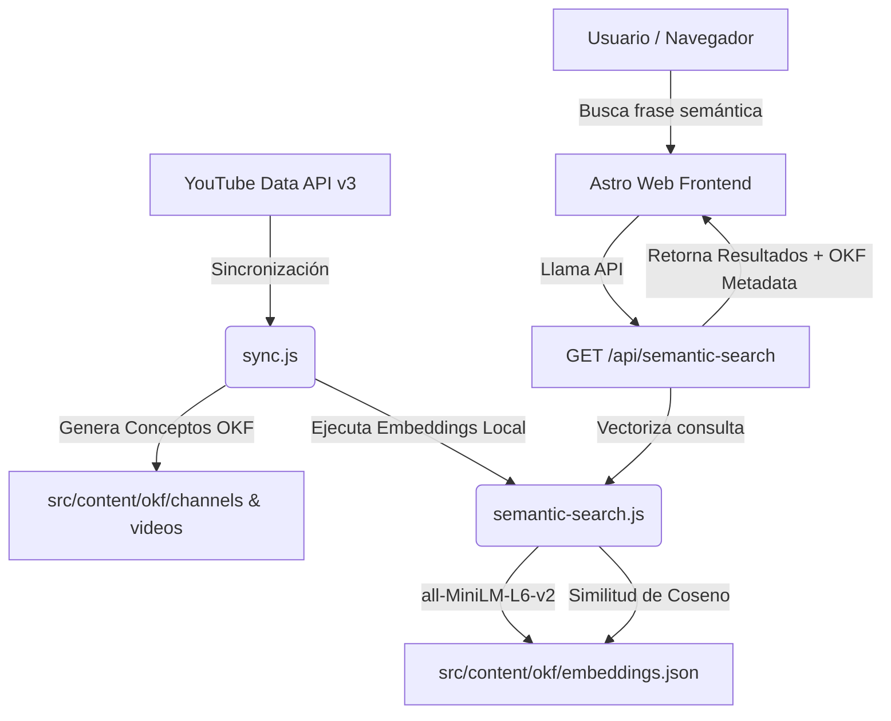

# Catálogo de YouTube de Diego Racero (RAG & OKF)

Este proyecto es una plataforma interactiva que extrae, almacena y visualiza todos los videos de los canales de YouTube de **Diego Racero** (`dracero@fi.uba.ar`) bajo la especificación abierta **Open Knowledge Format (OKF)** de Google Cloud. Además, implementa un buscador semántico gratuito y local (RAG) utilizando modelos de HuggingFace.

---

## 🏗️ Arquitectura y Funcionamiento

El proyecto está diseñado bajo una arquitectura de **Server-Side Rendering (SSR)** con **Astro** y Node.js, estructurado en los siguientes componentes clave:



### 1. Núcleo de Sincronización y OKF (`src/lib/sync.js`)
* Realiza consultas paginadas a la API de YouTube Data v3 de los 3 canales de Diego.
* Descarga las estadísticas de vistas, suscriptores, likes, comentarios, duración, etiquetas y descripción de cada video.
* Guarda la información en archivos Markdown individuales con metadatos estructurados en **YAML frontmatter** dentro de `src/content/okf/`, siguiendo estrictamente la especificación **OKF v0.2**:
  - `channels/<channel_id>.md`: Concepto del canal.
  - `videos/<video_id>.md`: Concepto del video.
  - `index.md`: Índice raíz que mapea el catálogo completo.

### 2. Motor de Similitud Semántica Local (`src/lib/semantic-search.js`)
* Utiliza la librería `@xenova/transformers` de HuggingFace para ejecutar localmente en la máquina del servidor el modelo **`Xenova/all-MiniLM-L6-v2`** (peso de aprox. 90MB).
* **Generación de Embeddings:** Al finalizar la sincronización, toma cada archivo OKF, une semánticamente el título, descripción y etiquetas, genera su vector de 384 dimensiones y lo guarda en `embeddings.json`.
* **Búsqueda Vectorial:** Cuando buscas en lenguaje natural, el servidor vectoriza tu frase en tiempo real y calcula la **similitud de coseno** con los vectores del catálogo en menos de 0.1ms.
* **Control de Relevancia (Umbral del 60%):** Si la consulta semántica tiene baja correlación (por ejemplo, buscar sobre un tema del que no posees videos en tus canales), el sistema despliega una alerta de baja relevancia, combinando el RAG vectorial con validaciones de confianza de OKF.

### 3. Frontend Web en Astro SSR
* **Lector Dinámico (`src/lib/okf-reader.js`):** Lee y procesa en tiempo real los archivos Markdown del disco usando `gray-matter` y `marked`. Además, intercepta y reescribe los links relativos de OKF (`../channels/id.md`) a rutas dinámicas del frontend (`/channels/id`), unificando el grafo.
* **Panel de Control (`src/pages/index.astro`):** Muestra estadísticas globales y ofrece dos pestañas de búsqueda:
  - **Búsqueda de Texto:** Filtrado rápido en el cliente por palabras y tags.
  - **Búsqueda Semántica:** Envía la consulta a la API local de Node.js y renderiza tarjetas dinámicas con su porcentaje de coincidencia.
* **Detalle del Canal (`src/pages/channels/[id].astro`):** Lista todos los videos del canal con un panel lateral que detalla los metadatos OKF del concepto y su procedencia (*sources*).
* **Detalle del Video (`src/pages/videos/[id].astro`):** Reproduce el video mediante un iframe de YouTube responsive, muestra su descripción completa respetando saltos de línea y detalla la procedencia del concepto.

---

## 🚀 Instalación y Configuración

### Requisitos previos
- Node.js (versión 22 o superior).

### Pasos para iniciar el proyecto

1. **Configurar el entorno:**
   Crea o edita el archivo `.env` en la raíz del proyecto y agrega tus credenciales:
   ```env
   YOUTUBE_API_KEY=tu_clave_de_api_de_youtube
   HF_TOKEN=tu_token_de_hugging_face_aqui
   ```

2. **Instalar dependencias del proyecto:**
   ```bash
   npm install
   ```

3. **Instalar dependencias de Playwright y navegadores:**
   Dado que el proyecto cuenta con pruebas automáticas de interfaz de usuario y utiliza el navegador para testing:
   ```bash
   npx playwright install
   sudo env "PATH=$PATH" npx playwright install-deps
   ```

---

## 🧞 Comandos útiles

Todos los comandos se corren desde la raíz del proyecto en la terminal:

| Comando | Acción |
| :--- | :--- |
| `npm run dev -- --background` | Inicia el servidor de desarrollo en segundo plano (`http://localhost:4321`) |
| `npx astro dev status` | Verifica el estado del servidor en segundo plano |
| `npx astro dev logs` | Visualiza los logs en tiempo real del servidor en segundo plano |
| `npx astro dev stop` | Detiene el servidor de desarrollo en segundo plano |
| `node -e "import('./src/lib/sync.js').then(m => m.syncCatalog({ force: true }))"` | Fuerza una sincronización de YouTube y generación de embeddings manual |
| `npm run build` | Compila el sitio Astro para producción utilizando el adaptador de Node.js |
| `npx playwright test` | Ejecuta la suite de pruebas E2E integradas para validar la funcionalidad |
