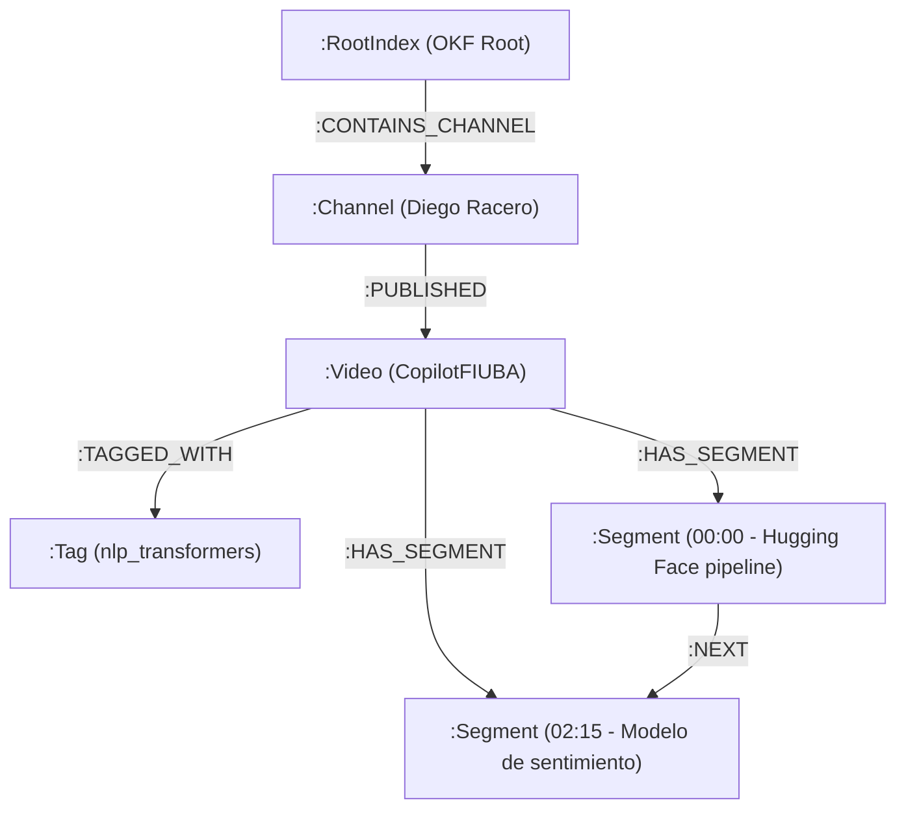

# Catálogo de YouTube Diego Racero: RAG, Open Knowledge Format (OKF) & TypeSafe AI (Jev)

Esta plataforma es un sistema de ingeniería de conocimiento interactivo diseñado para extraer, estructurar, clasificar y consultar semánticamente el catálogo de canales y videos de YouTube de **Diego Racero** (`dracero@fi.uba.ar`).

Combina:
1. La especificación abierta **Open Knowledge Format (OKF)** de Google Cloud para almacenar el conocimiento como texto plano portable y versionable en Git.
2. Una base de datos de grafos **Neo4j GraphRAG** con índices vectoriales nativos para búsquedas a escala $\mathcal{O}(\log N)$ y navegación de contexto secuencial (`:NEXT`).
3. Un motor de búsqueda semántica local de 384 dimensiones impulsado por `@xenova/transformers` (`all-MiniLM-L6-v2`).
4. **TypeSafe AI (Jev / System One)**: reemplazo total de LLMs generativos pesados por modelos de decisión probabilísticos ultrarrápidos (<200ms) para clasificación de videos, enrutamiento temático y selección de fragmentos.
5. Un **Asistente Virtual Multi-Agente** basado en **LangGraph.js** y **TypeSafe Jev** (100% libre de cuotas o dependencias de Gemini/OpenAI) que responde con citas temporales exactas hipervinculadas al segundo del reproductor de video.

---

## 🏗️ Arquitectura del Sistema

El sistema opera en tres fases principales: **Ingesta, Clasificación e Indexación**, **Búsqueda Semántica Híbrida / GraphRAG** y **Asistencia Conversacional Multi-Agente**.

```mermaid
flowchart TD
    subgraph Ingestion["Fase 1: Ingesta, Clasificación OKF y Embeddings"]
        YT["YouTube Data API v3"] -->|"1. Descarga metadata"| Sync["sync.js (Sync Engine)"]
        Sub["youtube-transcript"] -->|"2. Descarga subtítulos"| Sync
        Sync -->|"3. Clasificación temática Jev"| JEV_Classify["TypeSafe AI (Jev System One)"]
        JEV_Classify -->|"category, hasCode, difficulty"| Sync
        Sync -->|"4. Escribe conceptos OKF"| OKF_Files["Directorio src/content/okf/"]
        
        OKF_Files -->|"channels/:id.md"| Chan["Conceptos Canales"]
        OKF_Files -->|"videos/:id.md"| Vid["Conceptos Videos"]
        OKF_Files -->|"transcripts/:id.json"| Trans["Transcripciones Sidecar"]
        
        Vid & Trans -->|"5. all-MiniLM-L6-v2"| Embeddings["embeddings_chunks.json (384-dim)"]
        Embeddings & OKF_Files -->|"6. seedNeo4jFromOKF()"| Neo4j[(Neo4j GraphRAG bolt://localhost:7687)]
    end

    subgraph Chatbot["Fase 2: Asistente Conversacional 100% Jev (LangGraph)"]
        UserQuery([Consulta del Usuario]) --> RouterNode["🧭 RouterNode (TypeSafe Jev: domain + intent <100ms)"]
        RouterNode --> SearcherNode["🔍 SearcherNode (Neo4j GraphRAG / Local Embeddings)"]
        SearcherNode --> SelectorNode["🎯 SelectorNode (TypeSafe Jev: noul relevance filter)"]
        
        SelectorNode --> Decision{"¿Contexto suficiente?"}
        Decision -- "No (intentos < 2)" --> Expand["Query Expansion"] --> SearcherNode
        Decision -- "Sí / Límite alcanzado" --> ResponderNode["💬 ResponderNode (TypeSafe Jev: best_match + temporal links)"]
        ResponderNode --> Output([Respuesta Final con enlaces [⏱ Ir al minuto MM:SS]])
    end
```

---

## ⚡ TypeSafe AI (Jev / System One): Eliminación Total de LLMs Generativos

En lugar de recurrir a LLMs generativos pesados (como Gemini o GPT) que sufren de latencias de 2 a 5 segundos, costos elevados, cuotas prepagas (errores `402 RESOURCE_EXHAUSTED`) y alucinaciones, la plataforma utiliza **TypeSafe AI (modelo Jev)** mediante `@typesafe-ai/sdk`:

* **¿Qué es Jev?** Es un modelo "System One" entrenado con **RLCD (Reinforcement Learning for Calibrated Decisions)**. No genera texto libre; evalúa un estado y devuelve decisiones tipadas con probabilidades estadísticas calibradas en **70–250 ms**.
* **Costo:** **$0.042 por millón de tokens de entrada** (tokens de salida gratuitos).
* **Cero Alucinaciones:** Las respuestas están restringidas matemáticamente a los esquemas y criterios definidos en el código.

### Primitivas Utilizadas

| Primitiva | Sintaxis SDK | Uso en el Proyecto |
|---|---|---|
| **`choice`** | `choice(instructions, criteria)` | Clasificación de tema en videos (`category`) y enrutamiento en chatbot (`domain` e `intent`). Selección del fragmento destacado (`best_match`). |
| **`noul`** | `noul(instructions)` | Evaluación booleana probabilística (0.0 a 1.0) para verificar si un video tiene código en vivo (`has_code_demo`) y si un fragmento es relevante (`is_relevant`). |
| **`score`** | `score(instructions, criteria[])` | Evaluación en espectro continuo para nivel de dificultad técnica (`difficulty_score`) y cobertura de la respuesta (`quality`). |

### Configuración en `.env`
```env
# TypeSafe AI API Key (obtenida en https://console.typesafe.ai/home)
JEV_API_KEY=apikey_...
# o alternativamente:
# TYPESAFE_API_KEY=ts_live_...
```

---

## 📖 Integración OKF (Open Knowledge Format)

El **Open Knowledge Format (OKF)** es un estándar abierto para organizar el conocimiento en texto plano compatible con control de versiones:

* **Índice (`src/content/okf/index.md`):** Nodo raíz del catálogo que enumera los canales y métricas totales.
* **Canales (`src/content/okf/channels/*.md`):** Conceptos que describen cada canal de YouTube y sus estadísticas.
* **Videos (`src/content/okf/videos/*.md`):** Conceptos individuales de cada video sincronizado con metadatos enriquecidos por TypeSafe Jev.
* **Sidecars (`src/content/okf/transcripts/*.json`):** Transcripciones completas descargadas con timestamps precisos en segundos.

### Frontmatter Enriquecido de un Video (`videos/:id.md`)

```yaml
---
type: YouTube Video
title: "CopilotFIUBA"
description: "Desarrollo de pipeline de Hugging Face para análisis de sentimiento"
transcript_summary: "bien vamos a implementar el desarrollo del pipeline de hugging face utilizando sentiment analysis..."
resource: "https://www.youtube.com/watch?v=hQqrJvg_oP0"
category: "nlp_transformers"
category_confidence: 1
has_code_demo: true
difficulty_score: 1.69
tags: ["nlp_transformers", "huggingface", "sentiment-analysis", "python"]
generated: { by: "process:sync-youtube", at: "2026-09-23T16:12:40.000Z" }
verified: machine-confirmed
status: current
channel_id: "UCmyMY4FLYPYoO1IZhZPqc3w"
published_at: "2024-05-10T14:20:00Z"
view_count: 1420
like_count: 58
comment_count: 4
duration: "08:15"
thumbnail: "https://i.ytimg.com/vi/hQqrJvg_oP0/maxresdefault.jpg"
sources:
  - id: youtube-api
    resource: "https://developers.google.com/youtube/v3"
    title: "YouTube Data API v3"
---
```

---

## 🕸️ Neo4j GraphRAG & Embeddings Locales

El sistema almacena el conocimiento relacional y los vectores en una instancia de **Neo4j** (`bolt://localhost:7687`), complementado con una caché de vectores local en disco:



### Características de Neo4j GraphRAG (`src/lib/neo4j.js`):
1. **Índice Vectorial HNSW de 384 dimensiones (`transcript_vector_index`):** Búsqueda de similitud de coseno en Cypher con `db.index.vector.queryNodes('transcript_vector_index', limit, vector)`.
2. **Encadenamiento Secuencial (`:NEXT`):** Permite obtener el fragmento de audio anterior y posterior sin cálculos adicionales.
3. **Fallback Automático:** Si Neo4j no está iniciado, el sistema conmuta automáticamente a la búsqueda local sobre `src/content/okf/embeddings_chunks.json`.

### Iniciar Neo4j con Docker
El contenedor local ya está configurado en el entorno:
```bash
docker start neo4j-local
# O para crearlo desde cero:
# docker run -d --name neo4j-local -p 7474:7474 -p 7687:7687 -e NEO4J_AUTH=neo4j/password neo4j:5.20.0-community
```

---

## 💬 Asistente Multi-Agente 100% TypeSafe Jev (`src/lib/agent-graph.js`)

El chatbot está orquestado mediante **LangGraph.js**, pero todas las decisiones, clasificaciones y síntesis son ejecutadas por **TypeSafe Jev** (eliminando a Gemini):

1. **`routerNode` (Jev):** Identifica el dominio temático (`rag_and_agents`, `nlp_transformers`, `physics`, `education_moodle`, `general`) y la intención en **<100ms**.
2. **`searcherNode`:** Consulta primero a **Neo4j GraphRAG**; si no está disponible, consulta los embeddings locales.
3. **`selectorNode` (Jev):** Evalúa concurrentemente con la primitiva `noul` si cada fragmento recuperado es directamente relevante. Si la información es insuficiente, dispara una búsqueda expandida orientada al dominio temático.
4. **`responderNode` (Jev):** Utiliza `choice` para seleccionar el fragmento con mejor respuesta y `score` para evaluar la cobertura. Genera una respuesta en Markdown con enlaces interactivos al minuto y segundo exactos del reproductor:
   ```markdown
   👉 [⏱ Ir directamente al minuto 04:20 en el video](/videos/fGgFhYkmaI4?t=260)
   ```

---

## 🛠️ Comandos de Desarrollo

Todos los comandos se ejecutan desde la raíz del proyecto:

| Comando | Acción |
| :--- | :--- |
| `npm run dev -- --background` | Inicia el servidor Astro SSR en segundo plano (`http://localhost:4321`) |
| `npx astro dev status` | Verifica el estado del servidor en segundo plano |
| `npx astro dev logs` | Visualiza los logs en tiempo real del servidor en segundo plano |
| `npx astro dev stop` | Detiene el servidor en segundo plano |
| `docker start neo4j-local` | Inicia el contenedor local de Neo4j (puerto 7687) |
| `node tests/test-agents.js` | Ejecuta la prueba de agentes LangGraph + TypeSafe Jev en la terminal |
| `node .agents/skills/typesafe-ai/scripts/test-typesafe-client.js` | Prueba de conectividad directa con TypeSafe AI Jev |
| `node -e "import('./src/lib/sync.js').then(m => m.syncCatalog({ force: true }))"` | Sincroniza YouTube, clasifica con Jev y siembra Neo4j |
| `npm run build:index` | Clasifica todos los videos del catálogo con TypeSafe Jev y genera `classification_index.json` |
| `npm run verify` | Ejecuta la verificación de directivas, patrones, seguridad y build (`.agents/verify.sh`) |
| `npm run build` | Compila el sitio Astro para producción |

---

## 📁 Estructura del Proyecto

```text
├── .agents/
│   ├── AGENTS.md                  # Directivas de calidad, patrones y seguridad
│   ├── verify.sh                  # Suite de verificación pre-push
│   └── skills/
│       └── typesafe-ai/           # Skill de TypeSafe AI (guía, api-ref, ejemplos)
├── scripts/
│   └── build-index.js             # Indexador batch de clasificación con TypeSafe Jev
├── src/
│   ├── content/
│   │   └── okf/                   # Base de datos portable OKF (Markdown + JSON)
│   │       ├── channels/          # Conceptos de canales
│   │       ├── videos/            # Conceptos de videos con clasificación Jev
│   │       ├── transcripts/       # Transcripciones de audio con timestamps
│   │       ├── classification_index.json # Índice precalculado de categorías y scores
│   │       ├── embeddings.json    # Vectores de catálogo (384-dim)
│   │       └── embeddings_chunks.json # Vectores de transcripciones
│   ├── lib/
│   │   ├── typesafe.js            # Cliente Singleton y métodos de TypeSafe Jev
│   │   ├── indexer.js             # Módulo de indexación batch y lectura O(1) de categorías
│   │   ├── agent-graph.js         # Grafo LangGraph 100% TypeSafe Jev
│   │   ├── neo4j.js               # Driver, índices vectoriales y GraphRAG
│   │   ├── semantic-search.js     # Motor de búsqueda semántica híbrida
│   │   ├── sync.js                # Motor de sincronización YouTube + OKF
│   │   └── okf-reader.js          # Lector y parser del catálogo OKF
│   └── pages/
│       ├── index.astro            # Interfaz web principal (Buscador + Chatbot)
│       └── api/
│           ├── chat.js            # Endpoint del asistente conversacional
│           ├── semantic-search.js # Endpoint de búsqueda vectorial
│           └── sync.js            # Endpoint de sincronización manual
└── tests/
    └── test-agents.js             # Test del flujo conversacional con Jev
```
